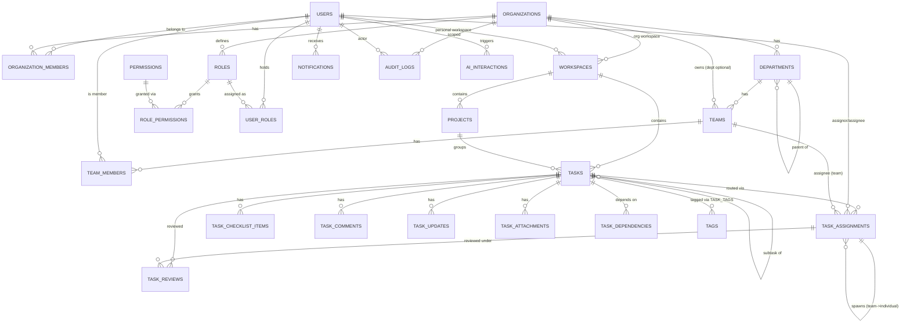

# 03 — Database ERD Proposal

Normalized PostgreSQL schema. Table names are proposals, not final — flag any renames in
your approval pass. All tables use `id uuid primary key default gen_random_uuid()` unless
noted, and `created_at timestamptz default now()`.

## 3.1 Entity-relationship diagram

## 3.2 Table definitions

### `users`
Mirrors `auth.users` (Supabase-managed) 1:1 via `id`.
| Column | Type | Notes |
|---|---|---|
| id | uuid PK | = `auth.users.id` |
| email | text unique | |
| full_name | text | |
| avatar_url | text | nullable |
| default_timezone | text | default `UTC` |
| created_at | timestamptz | |

### `organizations`
| Column | Type | Notes |
|---|---|---|
| id | uuid PK | |
| name | text | e.g. "ABC College" |
| slug | text unique | |
| settings | jsonb | feature flags, AI toggle, branding |
| created_by | uuid FK users | |
| created_at | timestamptz | |

### `organization_members`
| Column | Type | Notes |
|---|---|---|
| id | uuid PK | |
| organization_id | uuid FK | |
| user_id | uuid FK | |
| status | enum: `ACTIVE, INVITED, SUSPENDED` | |
| joined_at | timestamptz | |
| unique (organization_id, user_id) | | |

### `departments`
| Column | Type | Notes |
|---|---|---|
| id | uuid PK | |
| organization_id | uuid FK | tenant scope |
| parent_department_id | uuid FK departments, nullable | supports nesting |
| name | text | e.g. "Marketing" |
| created_by | uuid FK users | |
| created_at | timestamptz | |

### `teams`
| Column | Type | Notes |
|---|---|---|
| id | uuid PK | |
| organization_id | uuid FK | tenant scope (denormalized for RLS simplicity) |
| department_id | uuid FK departments, nullable | a team may sit outside any department |
| name | text | e.g. "Marketing Team" |
| created_by | uuid FK users | |
| created_at | timestamptz | |

### `team_members`
| Column | Type | Notes |
|---|---|---|
| id | uuid PK | |
| team_id | uuid FK | |
| user_id | uuid FK | |
| is_head | boolean default false | one or more heads per team allowed |
| joined_at | timestamptz | |
| unique (team_id, user_id) | | |

> Note: "Team Head" is *not* a global role — it is this per-row flag, scoped to one team.
> The same user can be `is_head=true` on Team A and `is_head=false` (plain member) on Team B
> (Rule/§9 example: Eldo is Team Head of Marketing, member elsewhere).

### `roles`
| Column | Type | Notes |
|---|---|---|
| id | uuid PK | |
| organization_id | uuid FK, nullable | null = system-defined template role (e.g. SUPER_ADMIN), non-null = org-custom role |
| name | text | e.g. "ORG_ADMIN", "Grants Officer" |
| is_system | boolean | true for the seeded template roles listed in doc 04 |
| created_at | timestamptz | |

### `permissions`
Seed table, effectively static/reference data.
| Column | Type | Notes |
|---|---|---|
| id | uuid PK | |
| key | text unique | e.g. `task.assign_cross_team` (full catalog in doc 04) |
| description | text | |

### `role_permissions`
| Column | Type | Notes |
|---|---|---|
| role_id | uuid FK | |
| permission_id | uuid FK | |
| PK (role_id, permission_id) | | |

### `user_roles`
This is what makes roles *contextual* rather than global (§9).
| Column | Type | Notes |
|---|---|---|
| id | uuid PK | |
| user_id | uuid FK | |
| role_id | uuid FK | |
| organization_id | uuid FK | which org this grant applies in |
| scope_type | enum: `ORGANIZATION, DEPARTMENT, TEAM` | |
| scope_id | uuid, nullable | department_id or team_id; null when scope_type=ORGANIZATION |
| granted_by | uuid FK users | |
| created_at | timestamptz | |

### `workspaces`
Unifies personal and org containers (doc 01 §1.3).
| Column | Type | Notes |
|---|---|---|
| id | uuid PK | |
| type | enum: `PERSONAL, ORGANIZATION` | |
| owner_user_id | uuid FK users, nullable | set iff type=PERSONAL |
| organization_id | uuid FK, nullable | set iff type=ORGANIZATION |
| name | text | display name |
| created_at | timestamptz | |
| check: exactly one of owner_user_id / organization_id is set | | |

### `projects`
| Column | Type | Notes |
|---|---|---|
| id | uuid PK | |
| workspace_id | uuid FK | |
| department_id | uuid FK, nullable | |
| team_id | uuid FK, nullable | |
| name | text | |
| description | text | |
| owner_id | uuid FK users | |
| status | enum: `ACTIVE, ON_HOLD, COMPLETED, ARCHIVED` | |
| created_at | timestamptz | |

### `tasks`
The core entity.
| Column | Type | Notes |
|---|---|---|
| id | uuid PK | |
| workspace_id | uuid FK | tenant/personal scope |
| project_id | uuid FK, nullable | |
| parent_task_id | uuid FK tasks, nullable | subtasks |
| title | text | |
| description | text | |
| priority | enum: `LOW, MEDIUM, HIGH, URGENT` | |
| status | enum | see doc 05 — full lifecycle |
| start_date | date, nullable | |
| due_date | timestamptz, nullable | |
| estimated_duration_minutes | int, nullable | |
| created_by | uuid FK users | task creator (Rule: distinct from assignor) |
| origin_department_id | uuid FK, nullable | **origin** for cross-department traceability (§10) — set once at creation/first assignment, never overwritten as the task is routed further |
| created_via | enum: `DIRECT, AI` | provenance |
| created_at / updated_at | timestamptz | |

> **Current owner (derived, not a stored column):** reporting/workload queries resolve
> "who owns this task right now" from the `task_assignments` row where `is_current = true`
> (its `assignee_user_id`/`assignee_team_id`), per the confirmed decision in doc 13 §12.
> `origin_department_id` and `created_by` above are preserved unchanged for audit/origin
> tracing, so a query can always report *both* "Marketing/Rahul currently owns this" and
> "this originated from Management" without ambiguity.

### `task_assignments`
The routing/acknowledgement chain — see doc 06 for the full state machine. This is the
single most important table for satisfying Rules 5–8.
| Column | Type | Notes |
|---|---|---|
| id | uuid PK | |
| task_id | uuid FK | |
| assignee_type | enum: `USER, TEAM` | |
| assignee_user_id | uuid FK, nullable | set iff assignee_type=USER |
| assignee_team_id | uuid FK, nullable | set iff assignee_type=TEAM |
| assigned_by | uuid FK users | who made *this* assignment |
| parent_assignment_id | uuid FK task_assignments, nullable | links a Team-Head's internal hand-off back to the team assignment it descends from — this is what encodes "Management → Marketing Team → Marketing Head → Rahul" as one traceable chain |
| status | enum: `PENDING_ACKNOWLEDGEMENT, ACCEPTED, DECLINED, SUPERSEDED` | SUPERSEDED = replaced by a reassignment |
| responded_by | uuid FK users, nullable | for TEAM assignments, the Team Head who accepted/declined on the team's behalf |
| responded_at | timestamptz, nullable | |
| decline_reason | text, nullable | required when status=DECLINED (Rule 8) |
| is_current | boolean | true for the active leaf of the chain; used for fast "who owns this right now" queries |
| created_at | timestamptz | |

### `task_checklist_items`
| id, task_id FK, label text, is_done boolean, position int, created_by uuid FK |

### `task_comments`
| id, task_id FK, user_id FK, body text, created_at, edited_at nullable |

### `task_updates`
Progress updates, distinct from free-form comments so dashboards can chart progress.
| id, task_id FK, assignment_id FK task_assignments, user_id FK, percentage int nullable, status_snapshot enum nullable, note text, created_at |

### `task_attachments`
| id, task_id FK, comment_id FK nullable, uploaded_by uuid FK, storage_path text, file_name text, mime_type text, size_bytes bigint, created_at |

### `task_dependencies`
| id, task_id FK, depends_on_task_id FK, type enum: `BLOCKS, RELATES_TO` |

### `task_reviews`
| id, task_id FK, assignment_id FK task_assignments, reviewer_id uuid FK, decision enum: `APPROVED, CHANGES_REQUESTED`, notes text, created_at |

### `tags` / `task_tags`
| tags: id, organization_id nullable, name, color |
| task_tags: task_id FK, tag_id FK, PK(task_id, tag_id) |

### `notifications`
| id, user_id FK, type text, payload jsonb, related_task_id FK nullable, is_read boolean, delivery_channel enum: `IN_APP, PUSH, EMAIL` (future), created_at |

### `audit_logs`
Append-only; see doc 12 for the DB-level immutability enforcement.
| id, organization_id FK nullable, actor_id uuid FK, action text (e.g. `task.assignment.accepted`), entity_type text, entity_id uuid, before jsonb nullable, after jsonb nullable, reason text nullable, source enum: `UI, API, AI, SYSTEM`, created_at |

### `ai_interactions`
| id, user_id FK, organization_id FK nullable, feature enum (`PARSE_TASK, SUGGEST_CHECKLIST, RECOMMEND_ASSIGNEE, SUMMARIZE_PROGRESS, DRAFT_FOLLOWUP, REVIEW_PRECHECK, ...`), input jsonb, output jsonb, model text, tokens_used int, accepted_by_user boolean nullable (did the human keep the AI's suggestion?), created_at |

## 3.3 Key constraints & indexes (non-exhaustive, called out because they enforce rules)

- `task_assignments`: partial unique index `(task_id) WHERE is_current = true AND assignee_type = 'TEAM'` is **not** enforced globally — multiple historical rows exist, but exactly one row per task should have `is_current = true` at any moment; enforced in `AssignmentService`, not just the DB, and mirrored with a DB trigger.
- `workspaces` check constraint (exactly one owner type) as noted above.
- `audit_logs`: `REVOKE UPDATE, DELETE ON audit_logs FROM app_user;` — only a service-role migration can alter history (§22 "immutable from normal application users").
- Every org-scoped table carries `organization_id` (denormalized onto `teams`, `projects`,
  etc. even though it's derivable via joins) specifically so RLS policies can be a flat,
  fast, single-column check instead of a multi-join subquery per row.
