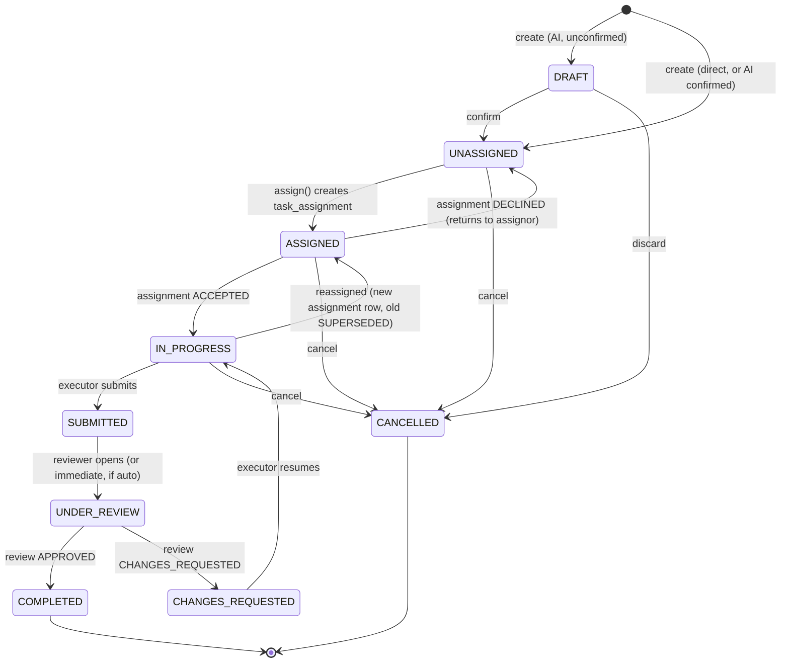

# 05 — Task State Machine

This governs `tasks.status` — the lifecycle of the work item itself, as distinct from the
per-assignment acknowledgement state in doc 06. A task's status is a function of its
current assignment chain state plus explicit submit/review/complete actions.

## 5.1 States

| Status | Meaning |
|---|---|
| `DRAFT` | Created but not yet dispatched (e.g. AI-parsed task awaiting confirmation, or a saved-not-sent form). |
| `UNASSIGNED` | Confirmed/saved but has no active assignment yet. |
| `ASSIGNED` | An assignment exists and is `PENDING_ACKNOWLEDGEMENT` (doc 06). |
| `IN_PROGRESS` | Current assignment is `ACCEPTED` and work has started. |
| `SUBMITTED` | Executor has submitted work for review. |
| `UNDER_REVIEW` | Reviewer is actively evaluating (may be same instant as SUBMITTED; kept distinct for dashboards). |
| `CHANGES_REQUESTED` | Reviewer sent it back. |
| `COMPLETED` | Reviewer approved (or, for tasks with no review step, executor marked done and had `task.complete`). Terminal. |
| `CANCELLED` | Creator/assignor called it off. Terminal. |
| *(`OVERDUE`)* | **Not a stored status** — a derived/computed flag (`due_date < now() AND status NOT IN (COMPLETED, CANCELLED)`), surfaced in UI/dashboards/notifications. Keeping it derived avoids a whole class of bugs where a task is both "IN_PROGRESS" and "OVERDUE" needing dual-status handling. |

## 5.2 Transition diagram

## 5.3 Transition authorization

| Transition | Who / permission |
|---|---|
| `DRAFT → UNASSIGNED` | Creator, confirming an AI-parsed draft |
| `UNASSIGNED → ASSIGNED` | Whoever holds the applicable `task.assign*` permission (doc 04 §4.5) |
| `ASSIGNED → IN_PROGRESS` | System-driven, triggered by the assignment's `ACCEPTED` event (doc 06) |
| `ASSIGNED → UNASSIGNED` | System-driven, triggered by `DECLINED` — returns to the assignor's queue with the decline reason attached |
| `IN_PROGRESS → SUBMITTED` | Current assignee (`task.update_progress` holder marking done) |
| `SUBMITTED/UNDER_REVIEW → COMPLETED` | Designated reviewer, `task.review` |
| `UNDER_REVIEW → CHANGES_REQUESTED` | Designated reviewer, `task.review` |
| `CHANGES_REQUESTED → IN_PROGRESS` | Current assignee resuming work |
| `* → CANCELLED` | Creator, current assignor, or `task.cancel` holder |

Every transition writes one `audit_logs` row (`before`/`after` status, actor, reason where
applicable) — this is what satisfies the §32 E2E requirement that "every major transition
must appear in the audit log."

## 5.4 Reassignment note

Reassigning mid-flight (`IN_PROGRESS → ASSIGNED` on the diagram) does not mutate the old
`task_assignments` row — it marks it `SUPERSEDED` and inserts a new row, preserving full
history of who was ever responsible for the task and when (needed for both audit and any
future workload-analytics features in Phase 4).
