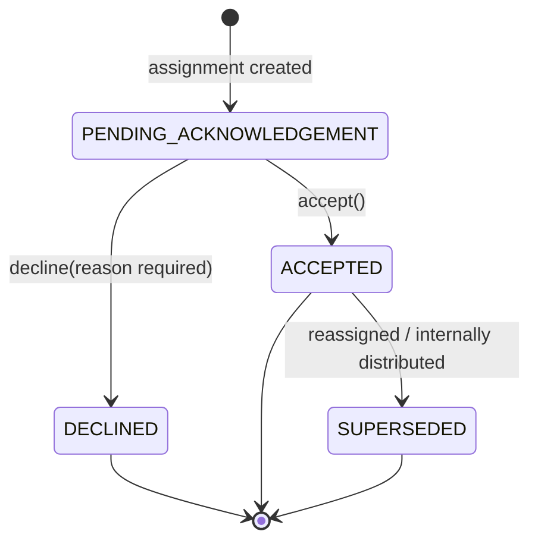

# 06 — Assignment / Acknowledgement State Machine

This is the mechanism behind Rules 4–8 and the §32 E2E scenario. It governs individual
`task_assignments` rows (doc 03 §`task_assignments`) — the "hops" a task takes as it's
routed to whoever actually executes it.

## 6.1 Per-assignment states



- `PENDING_ACKNOWLEDGEMENT`: created, notification sent, awaiting response. This is the
  *only* state in which Accept/Decline buttons are shown to the recipient.
- `ACCEPTED`: recipient has taken ownership. If `assignee_type = TEAM`, this means the
  Team Head accepted **on behalf of the team** — it does not yet mean any individual is
  working on it (see §6.3).
- `DECLINED`: terminal for this row; `decline_reason` is required (Rule 8); the parent
  task's status reverts to `UNASSIGNED` (doc 05) so the assignor can choose a new target.
- `SUPERSEDED`: this row was accepted but has since been superseded — either by the Team
  Head distributing internally (a new child row is created) or by an explicit reassignment.
  The row is kept, never deleted, for audit history.

## 6.2 The chain: why `parent_assignment_id` exists

A task can accumulate a **chain** of assignment rows, each representing one hop:

```
Row 1: task=T, assignee_type=TEAM, assignee_team_id=Marketing,
       assigned_by=Eldo (Management), status=ACCEPTED, responded_by=Anu(TeamHead)
       parent_assignment_id=NULL, is_current=false   ← superseded once Row 2 exists

Row 2: task=T, assignee_type=USER, assignee_user_id=Rahul,
       assigned_by=Anu, status=PENDING_ACKNOWLEDGEMENT,
       parent_assignment_id=Row1.id, is_current=true
```

This chain is what lets the UI show, at any time, the full lineage: *"Assigned by Eldo →
to Marketing Team → accepted by Anu (Team Head) → distributed to Rahul → pending Rahul's
acceptance"* — satisfying §10's requirement to display Origin / Destination / Assigned by
/ Accepted by / Internal assignee as distinct, correct fields, not a single flattened
"assignee."

## 6.3 Team assignment workflow (Rule 5, Rule 6)

**Critical rule, structurally enforced:** assigning a task to a team never creates N
pending assignments (one per member). It creates exactly **one** `task_assignments` row
with `assignee_type = TEAM`. Only that row needs a response, and only from a user holding
`task.accept_on_behalf_of_team` for that team (i.e., a Team Head, or anyone else the org
has granted that permission to for that team — doc 04 §4.6 already allows scoping a role
like that per-team).

```mermaid
sequenceDiagram
    participant Eldo as Eldo (Management)
    participant Sys as System
    participant Anu as Anu (Marketing Team Head)
    participant Rahul as Rahul (Marketing Member)

    Eldo->>Sys: assign(task, target=Team:Marketing)
    Sys->>Sys: create task_assignments row (TEAM, PENDING_ACKNOWLEDGEMENT)
    Sys->>Anu: notify "Task assigned to Marketing — action needed"
    Anu->>Sys: accept() [task.accept_on_behalf_of_team]
    Sys->>Sys: row.status = ACCEPTED, responded_by = Anu; task.status = IN_PROGRESS-pending-distribution
    Anu->>Sys: reassignInternal(task, target=User:Rahul) [task.reassign_internal]
    Sys->>Sys: row.status = SUPERSEDED; create child row (USER, Rahul, parent=row1, PENDING_ACKNOWLEDGEMENT)
    Sys->>Rahul: notify "Task assigned to you"
    Rahul->>Sys: accept() [task.accept]
    Sys->>Sys: child row.status = ACCEPTED; task.status = IN_PROGRESS
```

Note the task's overall `status` (doc 05) stays `ASSIGNED` from the moment the team
accepts until an individual has also accepted — the UI should distinguish "team accepted,
not yet distributed" from "individual accepted, work started" using the assignment chain,
not by inventing a new task-level status for it (avoids state-machine explosion).

## 6.4 Individual assignment workflow (Rule 7)

Identical mechanism, one hop, no team indirection:

```
Eldo → assign(task, target=User:Priya)
     → row(USER, Priya, PENDING_ACKNOWLEDGEMENT)
     → Priya sees: task details, [ACCEPT] [DECLINE]
     → accept() → row.status=ACCEPTED → task.status=IN_PROGRESS
```

## 6.5 What the recipient sees (§6 requirement)

Every `PENDING_ACKNOWLEDGEMENT` view (individual or Team-Head-on-behalf-of-team) renders,
non-negotiably: task title/description, assignor identity, reason/context if provided,
due date, priority, checklist preview, attachments, expected outcome, and exactly two
primary actions — **Accept** / **Decline** (decline requires a reason field before
submitting, enforced client- and server-side).

## 6.6 Decline handling (Rule 8)

`decline(assignmentId, reason)`:
1. Requires non-empty `reason`.
2. Sets row `status = DECLINED`, `decline_reason = reason`, `responded_by`, `responded_at`.
3. Writes an `audit_logs` entry.
4. Notifies the assignor (`assigned_by`) with the reason.
5. Reverts the parent task's status to `UNASSIGNED` — the assignor (not the system) chooses
   the next target; nothing is auto-reassigned (kept as a human decision, consistent with
   Rule 14).

## 6.7 Cross-department chain (§10)

No special-cased logic — a cross-department assignment is just a chain whose first hop's
`assigned_by` belongs to a different department than the `assignee_team_id`'s department.
The authorization check (doc 04 §4.5, `task.assign_cross_department`) is what gates it;
the chain/acknowledgement mechanics are identical to the same-department case.
