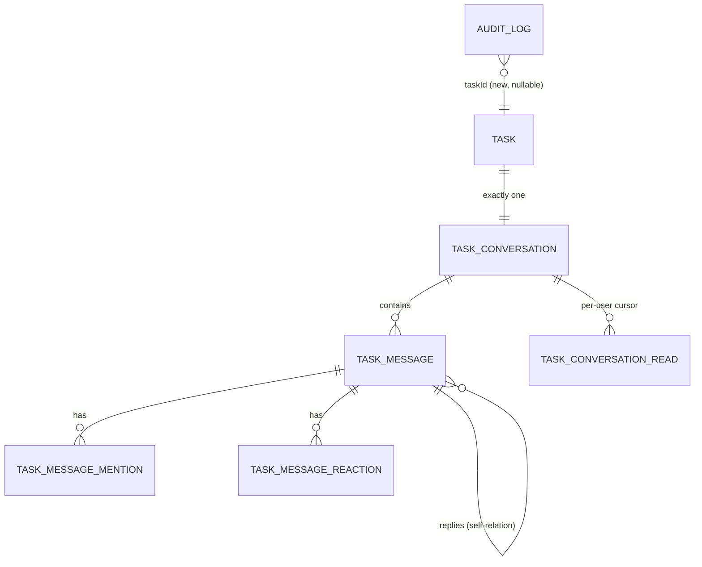

# 15 — Task Conversations (Phase 2A)

**Status: implemented.** This documents what actually shipped, not a design intent —
verified by the 37-test E2E suite (`tests/e2e/abc-college.e2e.test.ts`, "Phase 2A: Task
Conversations" block) running against real HTTP + real Postgres.

## 1.1 Product principle, restated as an architecture constraint

"The place where work conversations become work" — concretely, this means the
conversation is a *view onto task authorization*, never a second authorization system.
Every access decision a conversation makes is either (a) a direct call into
`TaskService`/`PermissionService` methods that already existed in Phase 1, or (b) one new,
narrowly-scoped composition of those same methods (§1.3). Nothing here introduces a new
role, a new permission key, or a membership table that could disagree with the task's own
notion of who's involved.

## 1.2 Data model

- **`TaskConversation`** — one row per task, `taskId` is `@unique` (a database constraint,
  not just an application convention — "no duplicate primary conversations" cannot happen
  even under a bug or a race). Created in the *same transaction* as the task itself, inside
  `TaskService.createTask` — never lazily. A migration
  (`20260906104200_backfill_task_conversations`) retroactively created one for every task
  that existed before this feature shipped, so the invariant is total, not just
  forward-looking.
- **`TaskMessage`** — always human-authored (`senderId` is required, never null). Has a
  self-relation `parentMessageId` for replies (one level; a reply's own replies are
  possible but the UI only surfaces one level of quoting). Soft-deleted (`isDeleted` +
  `deletedAt`, body left in place at the DB layer but never returned to clients once
  deleted) rather than hard-deleted, because a deleted message may be a reply's parent or
  carry mentions/reactions other rows reference, and because "historical messages remain
  part of task history" (the brief's own reassignment requirement) argues for keeping the
  row.
- **`TaskMessageMention`** — one row per (message, mentioned user). Existence of a row
  means the mention was *server-validated* at post time (see §1.4) — there is no
  unvalidated mention state.
- **`TaskMessageReaction`** — normalized: one row per (message, user, emoji), not a JSON
  blob on the message. A user can react with several different emoji to the same message,
  but not duplicate the same emoji twice (unique constraint).
- **`TaskConversationRead`** — a single `lastReadAt` timestamp per (conversation, user),
  not a per-message read receipt. Unread count is `count(messages where createdAt >
  lastReadAt and senderId != viewer)`. Deliberately simple per the brief's own guidance;
  the accepted trade-off is that two messages landing in the same database timestamp tick
  in a burst could rarely be misclassified — judged not worth a heavier model for Phase 2A.
- **`AuditLog.taskId`** (new, nullable column on the *existing* Phase 1 table) — see §1.5.

## 1.3 Access control: conversation access vs. task access

Every other Phase 1 access decision in the system funnels through
`TaskService.canViewTask` (public as of Phase 2A — previously private, renamed with no
behavior change) or `getTaskByIdOrThrow`, which throws using that same check. Conversation
access reuses exactly that logic **with one deliberate narrowing**, implemented as
`ConversationService.canAccessConversation` (private to that service):

| Case | Task view access (`canViewTask`, unchanged) | Conversation access (`canAccessConversation`, Phase 2A) |
|---|---|---|
| Creator | ✅ | ✅ (same) |
| Anyone ever `assignedBy`/`respondedBy` in the chain | ✅ | ✅ (same) |
| Current individual assignee | ✅ | ✅ (same) |
| `reports.view`/`audit.view` holder over the task's team/department | ✅ | ✅ (same) |
| **Plain member of the team the task is *currently* assigned to (not yet distributed)** | ✅ | ❌ — only whoever can act on the team's behalf (`PermissionService.canActOnBehalfOfTeam` — the Team Head, or an equivalent explicit grant) |

The narrowed case is exactly the brief's own example: *"Marketing team does not
automatically expose the conversation to every member... Rahul does not gain access
merely because he belongs to Marketing."* Phase 1's `canViewTask` intentionally grants
every team member visibility into a *task* that's pending at the team level (the team
needs to see what it's being asked to do before the Head decides) — that's correct,
unchanged, Phase 1 behavior, and changing it would be exactly the kind of Phase 1
redesign this phase was told not to do. So the narrowing lives entirely in the new
service, as its own explicit predicate, reusing `canActOnBehalfOfTeam` (existing,
unmodified) rather than re-deriving team-head status.

`TaskService.getTaskRawByIdOrThrow` (new) loads a task with no authorization check at
all, for exactly this one composition use — every `ConversationService` method calls it
and then applies `canAccessConversation` on top, rather than calling the broader
`getTaskByIdOrThrow`.

**Mentions** use the identical `canAccessConversation` check, applied to the *candidate*
mentioned user rather than the poster — never trusting the client's mention list, per the
brief. An invalid mention target rejects the entire message (400), rather than silently
dropping the mention.

**Posting/reacting** additionally requires the pre-existing `task.comment` permission
(`PermissionService.assertHasAnyGrantWithPermission`), the exact same bar Phase 1's
`addComment` already used — no new permission key was created.

**Editing/deleting** a message is sender-only, with no moderator override in Phase 2A —
the simplest correct model, deferring task-level chat moderation to a later phase if it
turns out to be needed.

## 1.4 Notifications

Two additive `NotificationType` entries (`message.added`, `task.mentioned`) using the
exact same `NotificationService.notify`/`notifyMany` calls every other Phase 1 event
already uses. A new message notifies the task creator, the current individual assignee,
and (for a reply) the parent message's sender — the same set `addComment` already
notified, extended to cover replies. A mention separately notifies each validated
mentioned user. No notification exists for reactions (judged low-signal, and not
mentioned in the brief's own notification-integration requirement, which named mentions
specifically).

## 1.5 Activity feed: reuses the audit log, not a new event-sourcing table

The brief listed `task_activity/events` as a plausible new table. Phase 2A instead adds
one nullable, indexed `taskId` column to the *existing* `audit_logs` table and threads it
through every task-related `AuditService.log()` call site that already existed
(`task.service.ts`, `assignment.service.ts` — one added field per call, no logic changed)
plus the new Phase 2A actions (`task.message_added`, `task.message_edited`,
`task.message_deleted`). `TaskActivityService.listForTask` is a thin, read-only method:
authorize via `getTaskByIdOrThrow`, then `AuditService.listForTask(taskId)` — one indexed
query. This was judged the more literal reading of "reuse the existing... audit...
architecture" than standing up a parallel table that would duplicate the same facts.

## 1.6 API surface

All under `/api/v1`, following doc 07's existing conventions (`withAuth`, Zod validation,
`{data, error}` envelope):

| Method | Path | |
|---|---|---|
| GET | `/tasks/:taskId/conversation` | conversation id + unread count |
| GET | `/tasks/:taskId/conversation/messages` | paginated, cursor-based |
| POST | `/tasks/:taskId/conversation/messages` | create (body: `body`, `parentMessageId?`, `mentionedUserIds?`) |
| POST | `/tasks/:taskId/conversation/read` | advance the caller's read cursor to now |
| PATCH | `/messages/:messageId` | edit (sender-only) |
| DELETE | `/messages/:messageId` | soft-delete (sender-only) |
| POST | `/messages/:messageId/reactions` | add (body: `emoji`) |
| DELETE | `/messages/:messageId/reactions/:emoji` | remove own reaction |
| GET | `/tasks/:taskId/activity` | audit-derived activity feed |

## 1.7 UI

The task detail page (`apps/web/app/(app)/tasks/[taskId]/page.tsx`) is now tabbed:
**Overview / Conversation / Checklist / Activity**. Overview keeps every Phase 1 action
panel (accept/decline, internal-assign, progress, review, assign) unchanged. Checklist is
the same checklist UI, just relocated to its own tab. Activity combines the existing
`AssignmentChain` component with the new audit-derived feed. Conversation is entirely new
(`components/task-detail/ConversationTab.tsx`): message list, composer, reply-quoting,
a checkbox-style mention picker (not live @-autocomplete — see §1.8), reaction chips, and
edit/delete controls visible only on the viewer's own messages.

The pre-existing simple comment feature (`TaskComment` model, `addComment`/`listComments`,
`/api/v1/tasks/:id/comments`) is **untouched at the API/domain layer** — zero Phase 1
regression risk — but is no longer surfaced in the task detail UI, superseded there by the
Conversation tab.

## 1.8 Known Phase 2A limitations

- **Mention candidates in the UI** are computed client-side as "task creator + everyone
  who has appeared in the assignment chain" — a good but not perfect proxy for
  `canAccessConversation` (it misses, e.g., a Team Head who hasn't yet acted). This is a
  UI suggestion only; the server independently re-validates every mention regardless, so
  the gap is a UX rough edge, never a security one.
- **No live @-autocomplete while typing** — mentions are chosen via an explicit picker
  toggled by an "@" button, not parsed from the message text.
- **No moderator override** on edit/delete — sender-only.
- **No attachments** (file/image/video) — explicitly out of scope, deferred to Phase 2B.
- **No test-database reset** between E2E runs (same accepted limitation as Phase 1) —
  E2E fixtures use timestamp-suffixed emails so repeated local runs don't collide.
