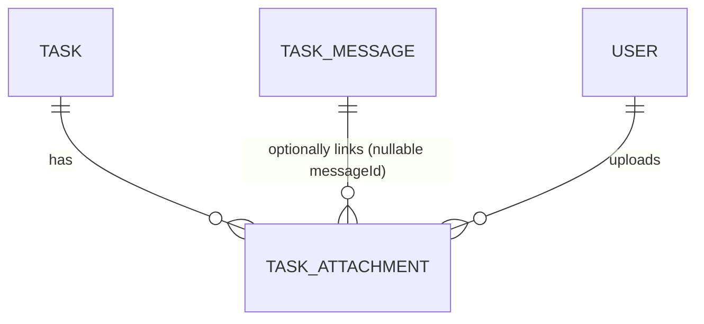

# 16 — Work Files & Attachments (Phase 2B)

**Status: implemented.** Documents what shipped, verified by 60 E2E tests (23 new for
this phase) plus domain-level integration tests for the two failure-consistency
scenarios, all running against real HTTP + real Postgres + real local-disk storage.

## 1.1 Product principle, restated as an architecture constraint

Files are work artifacts attached to conversations/tasks — not a general-purpose Drive.
Concretely: there is no organization-wide file browser, no cross-task file sharing, and
no endpoint that lists or serves a file without first re-deriving authorization from the
task/conversation model. **PostgreSQL stores attachment metadata; binary content is
stored in object storage (local disk in dev), never in the database.**

## 1.2 Reused, not duplicated

- **`TaskAttachment`** already existed in the schema from Phase 1 (linked to the old
  `TaskComment`, unused by any code path). Extended here, not replaced: a new nullable
  `messageId` FK to `TaskMessage` sits alongside the untouched `commentId`, plus
  `isDeleted`/`deletedAt` matching Phase 2A's soft-delete convention.
- **`StorageService`** already existed from Phase 1 (doc 14), also unused anywhere.
  Redesigned to a minimal opaque key-value shape (`put`/`get`/`delete`/optional
  `getSignedDownloadUrl`) since nothing depended on its previous shape — this *is* the
  storage abstraction the phase needed, not a new one.
- **Authorization**: no new permission keys, no new role concept. Upload/list/retrieve/
  delete all funnel through the exact same `canAccessConversation` predicate Phase 2A
  extracted for reuse (see doc 15 §1.3) — see §1.4 below for why attachments use this
  rule uniformly rather than task view access.

## 1.3 Data model

`TaskAttachment` fields: `id`, `taskId`, `messageId` (nullable), `uploadedById`,
`storagePath` (opaque server-generated key, never a filename or client-supplied path),
`fileName` (display metadata only), `mimeType`, `sizeBytes`, `isDeleted`/`deletedAt`,
`createdAt`. Indexes: `(taskId, createdAt)` for Task Files listing, `(messageId)` for
resolving a message's attachments.

**Storage key**: `<org_{orgId}|user_{ownerId}>/task_{taskId}/{attachmentId}` — built
server-side from the task's own workspace (never a client-supplied organization id) and
the attachment's own server-generated UUID. The original filename never appears in the
physical path at all, which is what makes path-traversal via a malicious filename
structurally impossible rather than merely filtered (see §1.6).

## 1.4 Authorization: one rule, not two

Every attachment operation (upload, list, retrieve, delete-check) requires
`canAccessConversation(userId, task)` — the identical Phase 2A predicate, regardless of
whether the specific attachment happens to be linked to a message yet. This was not the
first design: an earlier version split it — plain task access (`canViewTask`) for a
direct, not-yet-message-linked upload, conversation access only for message-linked ones.
A test written against this phase's own required regression scenario ("team assignment
does not expose Files to the whole team") caught that split letting a plain team member
list and upload files while the task sat team-pending, because `canViewTask`
intentionally grants team-pending visibility to every member (correct, unchanged Phase 1
behavior for the *task itself*). Unifying to one rule — conversation access, always —
closed that gap and is simpler besides. `messageId` remains useful for UI grouping
(which message a file was shared through) but no longer drives a different authorization
tier.

Uploading additionally requires the pre-existing `task.comment` permission — the same bar
posting a message already uses, not a new one.

Editing is sender/uploader-only, matching Phase 2A's message edit/delete precedent
exactly — no moderator override in this phase either.

## 1.5 Upload flow

Two-step REST, not one endpoint mixing multipart and JSON:

1. `POST /tasks/:id/attachments` (multipart) — validates, writes to storage, creates
   `TaskAttachment` rows with `messageId = null`, returns their metadata.
2. `POST /tasks/:id/conversation/messages` (existing Phase 2A endpoint, extended) —
   accepts an optional `attachmentIds` array; each id is re-verified (belongs to this
   task, was uploaded by this actor, not already linked elsewhere) before being stamped
   with the new message's id inside the same transaction that creates the message.

This keeps each endpoint's contract simple and mobile-friendly (a future client uploads
files first, gets stable ids back, then composes the message) rather than needing to
choreograph a single multipart-plus-structured-fields request.

**Orphan prevention**: all files in one upload request are validated before any storage
write happens; if a later file's storage write fails, or the database transaction fails
after all writes succeeded, every file written in that request is deleted (best-effort,
not a distributed saga) before the error propagates. Verified directly (not just by
inspection) in `task-attachment.service.failure.test.ts`, which fault-injects both a
storage-layer failure mid-batch and a database-transaction failure after storage
succeeded, and asserts zero orphaned files and zero inconsistent rows in both cases.

**Message text became optional** (`createMessageSchema.body`) so an attachment-only
message is valid — but a `.refine` still rejects a message with neither text nor
attachments, so there is no way to post nothing at all, and plain text-only messages are
completely unaffected.

## 1.6 Validation (`packages/domain/src/attachment-policy.ts`)

Centralized, allowlist-only (nothing is permitted by merely being absent from a
denylist):

- **Size**: 25MB per file (`MAX_ATTACHMENT_SIZE_BYTES`), 10 files per upload request.
- **Types**: images (jpeg/png/webp/gif), documents (pdf/doc/docx/xls/xlsx/ppt/pptx/txt),
  video (mp4/webm) — declared MIME type must be in the allowlist AND match the file's own
  extension.
- **Explicitly blocked extensions** regardless of declared MIME:
  `exe dll bat cmd ps1 sh js mjs cjs html htm svg apk msi com jar` — `svg` is called out
  specifically because its MIME type is technically an image type but it can carry script
  content, so it's excluded even though other images are allowed.
- **Filename**: sanitized for *display* only (strips path separators, `..`, control
  characters, caps length) — the storage key never uses the filename at all, so
  path-traversal through a malicious filename is structurally impossible, not just
  filtered. Verified directly: uploading a file named `../../../etc/passwd.txt` succeeds,
  returns a sanitized display name with no `/` or `..`, and the file is still correctly
  retrievable — proving the physical key was never derived from client input.

Not implemented (documented, not silently skipped — see §1.9): magic-byte content
sniffing and antivirus scanning. Declared MIME + extension consistency is judged
sufficient for Phase 2B; stronger content verification is future work.

## 1.7 Secure retrieval

`GET /attachments/:id` (not `/tasks/:id/attachments/:id` — deliberately flat, since
authorization is re-derived from the attachment's own task regardless of what's in the
URL) re-authorizes on every call: loads the attachment, resolves its task, applies
`canAccessConversation`. A well-formed but non-existent or unauthorized attachment id
returns 404/403 indistinguishably from a real one the caller can't see — never a
different signal that would help enumerate valid ids (not that it would matter much:
attachment ids are UUIDs).

The response is either a redirect to a provider-issued signed URL (only if the storage
adapter implements `getSignedDownloadUrl` — the local-disk adapter doesn't, since it has
no such concept) or the file streamed directly through the server with
`Content-Disposition: attachment`, `Cache-Control: private, no-store`, and the correct
`Content-Type` — never a permanent or public URL.

## 1.8 Deletion

Soft delete only (`isDeleted`/`deletedAt`) — the physical bytes are kept. A deleted
attachment is excluded from Task Files listings and message attachment lists, and its
retrieval endpoint returns 404. Physical storage cleanup (an actual retention/purge job)
is explicitly deferred — doc 16 follows the same "don't destroy audit/history data
immediately" posture Phase 2A already established for messages.

## 1.9 API surface

| Method | Path | |
|---|---|---|
| POST | `/tasks/:id/attachments` | multipart upload, 1–10 files, returns created attachment records |
| GET | `/tasks/:id/attachments` | Task Files listing |
| GET | `/attachments/:id` | secure retrieval (stream or signed-URL redirect) |
| DELETE | `/attachments/:id` | soft delete (uploader-only) |
| POST | `/tasks/:id/conversation/messages` | extended (Phase 2A endpoint) with optional `attachmentIds` |

`apps/web/lib/api.ts` gained one new wrapper, `withAuthRaw`, alongside the existing
`withAuth`/`withPublic` — same auth pipeline, but lets the one route that must return
binary content (not the JSON envelope) build its own `NextResponse`.

## 1.10 UI

Task detail tabs are now **Overview / Conversation / Checklist / Files / Activity**. The
Conversation composer gained a file picker (multi-select, remove-before-send, upload
state on the Send button); message bubbles and the Files tab share one
`AttachmentChip` component (icon or inline thumbnail for images, filename, size,
authenticated download link). No office-document rendering, no video transcoding, no
thumbnail generation service — previews are limited to what the browser can already do
safely (inline `` for images via the same authenticated retrieval endpoint;
everything else is a plain download link).

## 1.11 Known limitations (deferred, not silently dropped)

- No magic-byte content sniffing or antivirus scanning (§1.6).
- No presigned-URL support in the local-disk adapter (§1.7) — the interface supports it
  for a future S3-compatible adapter, but nothing in Phase 2B exercises that path.
- No physical storage cleanup job for soft-deleted attachments (§1.8).
- No office-document preview/thumbnails/OCR (§1.10).
- No resumable/chunked upload for very large files — the whole request body is buffered
  in memory before validation, which is fine at the 25MB limit but wouldn't scale to a
  much larger one without revisiting this.
- Event/Project Workspace (Organization → Event → Task → Conversation → Attachment) is
  explicitly out of scope — `TaskAttachment` is keyed to `taskId` only, with no
  UI-specific concept baked into the model that would block that future hierarchy.
